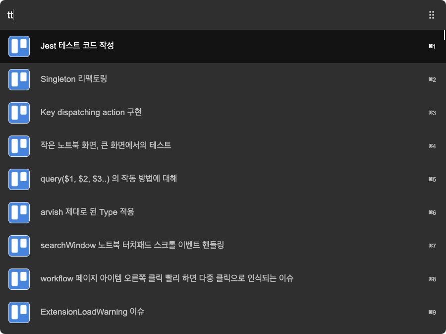

# Trello arvis Workflow

> Arvis workflow for Trello. Search your boards, quickly add cards, and view list of cards from Trello right in arvis.



## Install

```
$ npm install --global arvis-trello
```

## Commands

- In arvis, type `t` and your query to search for your Trello boards. Press <kbd>Enter</kbd> to open the board's URL.
- In arvis, type `tt`, and press <kbd>Enter</kbd> to show the cards in your specifed board.
- In arvis, type `tc`and your query. Press <kbd>Enter</kbd> to add a card to your specified list.

## Workflow Configuration (Environment Variables)

| name          | value         |
| ------------- | ------------- |
| key           | [Get Trello API key](https://trello.com/app-key) |
| token         | [Get Trello API token](https://trello.com/app-key) |
| board         | Get board id from the board URL |
| list          | Get the list id from your Trello board |
| user          | Get your Trello username |

* FAQ: How do I find the `id`s?

1. Open the Trello board that contains the list.

2. If the list doesn't have any cards, add a card to the list.

3. Open the card, add '.json' at the end of the URL, and press enter.

4. In the JSON file, you will see a field called `id`, `idList`.

5. put `id` on `board`, `idList` on `list`.

6. get your `user` value from profile page.

## License

MIT © [mblode](https://matthewblode.com)

## 🔗 This workflow is converted from [alfred-workflow](https://github.com/mblode/alfred-trello).

* Note that there might be some code change or different actions from the original workflow.

* Marked original workflow's creator to author.
